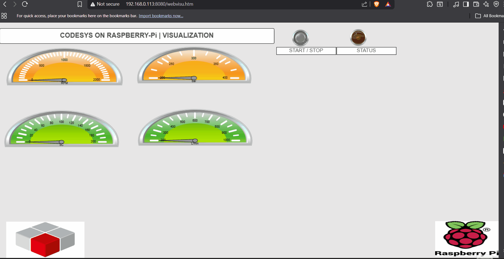

# 🏭 Industrial Edge Control: CODESYS on Raspberry Pi 5


## 📖 Overview
This project demonstrates the convergence of **IT (Linux)** and **OT (Industrial Control)** by transforming a high-performance **Raspberry Pi 5** into a PLC.

Using the **CODESYS Control Runtime**, this system executes real-time logic for sensor data processing and provides a web-based Human-Machine Interface (HMI) for operator control.

---

## 💡 Architecture Concept: The "All-in-One" Edge Controller
Traditionally, industrial automation requires two separate hardware devices: a PLC for logic and a dedicated HMI panel for visualization. 

This project demonstrates the **modern PC-based automation approach** (similar to Beckhoff CX or WAGO PFC architectures), where a single multicore processor handles both tasks:

* **Core Logic:** The CODESYS Runtime executes IEC 61131-3 logic in real-time.
* **Visualization:** The WebVisu server hosts the HMI, accessible via any HTML5-compliant browser (tablets, phones, desktops).

By virtualizing these functions on a Raspberry Pi 5, we achieve a high-performance, cost-effective Industrial Edge Controller that bridges the gap between IT and OT.

---

## 📸 Visualization Preview


*Figure 1: Real-time WebVisu HMI controlling logic on the Raspberry Pi.*

---

## ✨ Key Features
* **🧠 Structured Logic:** Implements `Sensor_Data.project` using **Structured Text (ST)** to simulate and process analog signal data.
* **📊 Integrated HMI:** Features a WebVisu dashboard accessible via any browser on the local network.
* **⚡ High-Performance:** Leverages the Raspberry Pi 5 (16GB RAM).

## 🛠️ Hardware & Software Stack

| Category | Specification |
| :--- | :--- |
| **Controller** | Raspberry Pi 5 (16GB RAM) |
| **OS** | Raspberry Pi OS (Debian Bookworm) |
| **IDE** | CODESYS Development System V3.5 |
| **Runtime** | CODESYS Control for Raspberry Pi SL |

## 🚀 How to Run

### 1. Prerequisites
Ensure you have the CODESYS Development System installed on your PC. You also need to install the Raspberry Pi package:
* Open CODESYS Installer.
* Search for and install: **"CODESYS Control for Raspberry Pi SL"**.

### 2. Deployment
1.  Clone this repository:
    ```bash
    git clone [https://github.com/Abdullah-TAY/Industrial-Control-System-on-Raspberry-Pi--CODESYS-.git](https://github.com/Abdullah-TAY/Industrial-Control-System-on-Raspberry-Pi--CODESYS-.git)
    ```
2.  Open `src/Sensor_Data.project` in CODESYS.
3.  **Update Gateway:** Double-click the "Device" node and scan for your Pi's IP address.
4.  **Login & Download:** Press `Alt+F8` to login and load the runtime.
5.  **Start:** Press `F5` to run the PLC.

### 3. Access HMI
Open your web browser and navigate to:
```text
http://<YOUR_PI_IP>:8080/webvisu.htm
